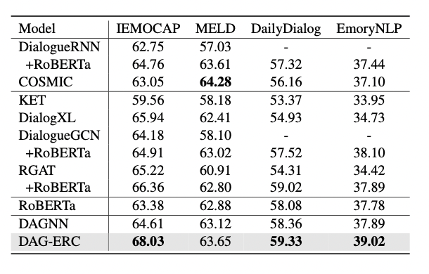
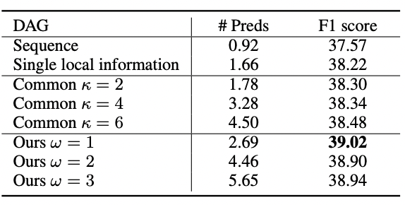

## Reviewed paper: [Directed Acyclic Graph Network for Conversational Emotion Recognition](https://aclanthology.org/2021.acl-long.123.pdf)

Ruifeng Zhang/ CS 541/ rzhang66@stevens.edu

 

# Abstract

The researchers are trying to find a better way to model emotion recognition from conversations. The paper proposed a novel idea of encoding the utterances with a directed acyclic graph (DAG) to better model the intrinsic structure within a conversation and designed a directed acyclic neural network model. The result is positive and demonstrated the superiority of this new model.

**Repo link**: https://github.com/failury/CS-541-optional-project

# Introduction

# Method

The researcher of the paper built a directed acyclic graph to model the information propagation in a conversation. Each node is a utterance and the edge is the information propagate between each utterances; the relation of each edge can be 0 or 1 where 1 for that the two connected utterances are spoken by the same speaker, and 0 for otherwise. The model is primarily inspired by DAGNN with novel im- provements specially made for emotion recognition in conversation. At each layer l of DAG-ERC, due to the temporal information flow, the hidden state of utterances should be computed recurrently from the first utterance to the last one.


# Data

##### Dataset descriptions

[DailyDialog](https://paperswithcode.com/dataset/dailydialog): Human-written dialogs collected from communications of English learners. 7 emotion labels are included: neutral, happiness, surprise, sadness, anger, disgust, and fear. Since it has no speaker information, we consider utterance turns as speaker turns by default.

[EmoryNLP](https://paperswithcode.com/dataset/emorynlp): TV show scripts collected from Friends, but varies from MELD in the choice of scenes and emotion labels. The emotion labels of this dataset include neutral, sad, mad, scared, powerful, peaceful, and joyful.

[IEMOCAP](https://paperswithcode.com/dataset/iemocap): A multimodal ERC dataset. Each conversation in IEMOCAP comes from the performance based on a script by two actors. Models are evaluated on the samples with 6 types of emotion, namely neutral, happiness, sadness, anger, frustration, and excitement. Since this dataset has no validation set, we follow Shen et al. (2020) to use the last 20 dialogues in the training set for validation.

[MELD](https://paperswithcode.com/dataset/meld): A multimodal ERC dataset collected from the TV show Friends. There are 7 emotion labels including neutral, happiness,surprise, sadness, anger, disgust, and fear.


##### Pre-processing

After downloading the file from the given [Link](https://drive.google.com/file/d/1R5K_2PlZ3p3RFQ1Ycgmo3TgxvYBzptQG/view?usp=sharing), extract the files and remove all the version numbers on the file names. For example: `dev_data_roberta_v9.json.feature` should be rename to `dev_data_roberta.json.feature`. I have provided the reason for this in **Problems/Issues** section.

In order to run the code correctly the overall file structure should look like this:

```
ProjectRoot
|   .gitignore
|   main.ipynb
|   Mini Project-1.pdf
|   output.doc
|   README.md
|   
+---.vscode
|       settings.json
|       
+---DAG_ERC_CODE
|   |   dataloader.py
|   |   dataset.py
|   |   evaluate.py
|   |   LICENSE
|   |   model.py
|   |   model_utils.py
|   |   ORIGINAL.md
|   |   run.py
|   |   trainer.py
|   |   utils.py
|   |   
|   +---saved_models
|   |   +---DailyDialog
|   |   +---EmoryNLP
|   |   +---IEMOCAP
|   |   |       logging.log
|   |   |       
|   |   \---MELD
|   \---__pycache__
|           dataloader.cpython-39.pyc
|           dataset.cpython-39.pyc
|           model.cpython-39.pyc
|           model_utils.cpython-39.pyc
|           trainer.cpython-39.pyc
|           utils.cpython-39.pyc
|           
+---data
|   +---DailyDialog
|   |       dev_data_roberta.json.feature
|   |       label_vocab.pkl
|   |       speaker_vocab.pkl
|   |       test_data_roberta.json.feature
|   |       train_data_roberta.json.feature
|   |       
|   +---EmoryNLP
|   |       dev_data_roberta.json.feature
|   |       label_vocab.pkl
|   |       speaker_vocab.pkl
|   |       test_data_roberta.json.feature
|   |       train_data_roberta.json.feature
|   |       
|   +---IEMOCAP
|   |       dev_data_roberta.json.feature
|   |       label_vocab.pkl
|   |       speaker_vocab.pkl
|   |       test_data_roberta.json.feature
|   |       train_data_roberta.json.feature
|   |       
|   \---MELD
|           dev_data_roberta.json.feature
|           label_vocab.pkl
|           speaker_vocab.pkl
|           test_data_roberta.json.feature
|           train_data_roberta.json.feature
|           
\---__pycache__
        dataloader.cpython-39.pyc
        dataset.cpython-39.pyc
```

The provided code has logic for processing the data: When the user executes the run command with desired arguments the program will load all the files respectably and save the data into a `IEMOCAPDataset` object with all the necessary information for the trainer to work.

# Tools & Technologies

* Python 3.9.11
* CUDA 11.6

##### python packages:

- [Pytorch](https://pytorch.org/)
- [numpy](https://numpy.org/)
- [pandas](https://pandas.pydata.org/)
- [sklearn](https://scikit-learn.org/stable/)
- [Transformers](https://github.com/huggingface/transformers)

Running on Jupyter notebook locally with RTX 2080

# Experiments

Initially, I run the code with provided command in the author's readme file: `python run.py --dataset IEMOCAP --gnn_layers 4 --lr 0.0005 --batch_size 16 --epochs 30 --dropout 0.2`. The command means to run training on "IEMOCAP" dataset with 4 gnn layers, 0.0005 learning rate, 16 batch size, 30epochs, and 0.2 dropout rate.

# Results

After running command `python run.py --dataset IEMOCAP --gnn_layers 4 --lr 0.0005 --batch_size 16 --epochs 30 --dropout 0.2`. The program ran for 8 minutes and 30.7 seconds on RTX 2080. Each epoch took about 15 ~ 30 seconds. The program outputs model's best f-score based on validation is 66.26.


Paper’s result:




Results vs different DAGs:


# Problems/Issues

- While trying to use the provided loader to load the dataset, I found the loading code presuming the data folder is in the parent directory of `dataloader.py`. To avoid changing the author's source code may cause problems, I put all the source code into a newly created folder `DAG_ERC_CODE/` and change the import statement differently.
- Another problem occurred while trying the load the data. The code presumes the dataset names do not contain any version number but the provided dataset all have names like `test_data_roberta_v2.json.feature`, so I have to manually delete the version numbers of those files to make the code work.


# Conclusion